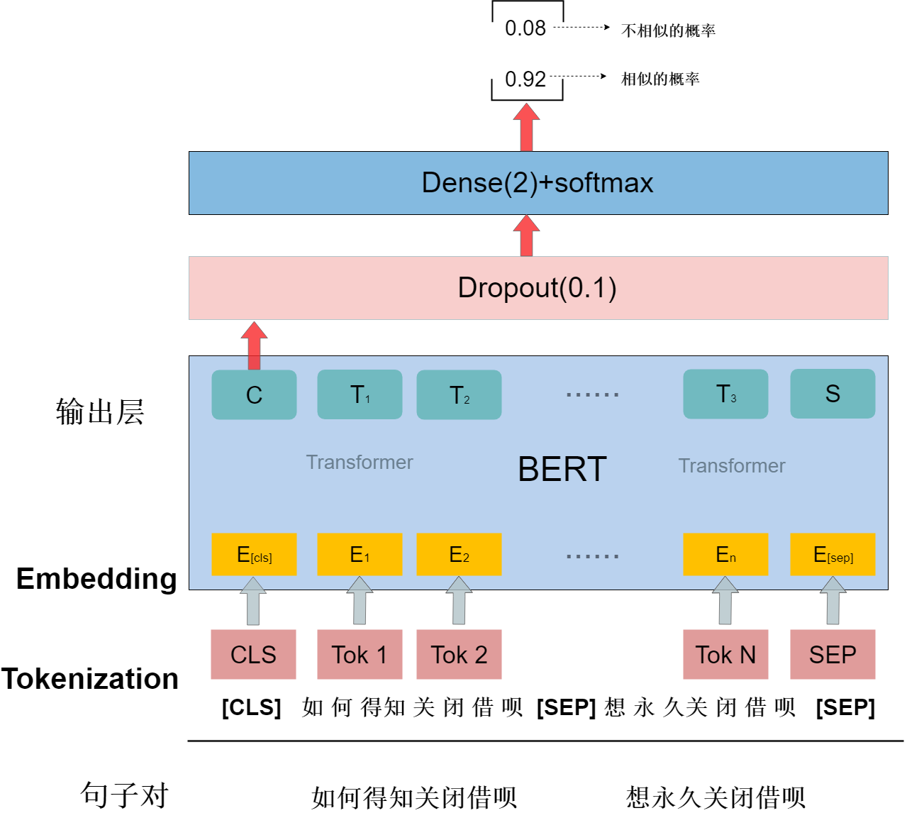
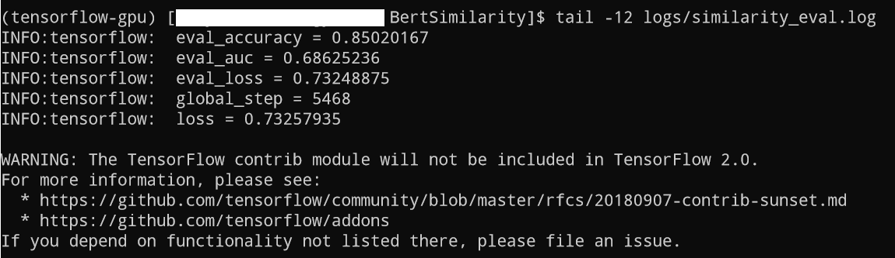

# BertSimilarity

基于Google的BERT模型来进行语义相似度计算。代码基于tensorflow 1。

## 1. 基本原理

简单来说就是将需要计算的相似的两个句子先拼接在一起，然后通过Bert模型获取获取整体的编码信息，接着通过全连接层将维，输出相似和不相似的概率。


## 1.1 模型结构

模型结构如图所示：



### 1.1.1 数据预处理

本文使用Bert模型计算相似度前，首先要对输入数据进行预处理，例如当要处理的文本是：

```text
如何得知关闭借呗   想永久关闭借呗
```

首先要将文本按token化，切分成字数组:

```json
[如 何 得 知 关 闭 借 呗]

[想 永 久 关 闭 借 呗]
```

然后将两个切分后的句子，按照如下的方式拼接：

```json
[CLS] 如 何 得 知 关 闭 借 呗 [SEP] 想 永 久 关 闭 借 呗 [SEP]
```

拼接后句子中的[CLS]是一个特殊分隔符表示每个样本的开头，[SEP]是样本中每个句子的结束标记符。拼接后的样本长度是len(A)+len(B)+3，因为加上了[CLS]和[SEP]特殊标识符的，3指的是1个[CLS]和2个[SEP]。在模型中，会指定最大样本长度LEN，本次实验中指定的是30），也就处理后的样本长度和不能超过LEN，即

```python
len(A) + len(B) + 3 <= LEN
```

超出最大长度的部分会被截取。然后继续对输入数据进行处理，将内容数字化。将token数组转化为token的索引数组，所有的样本会被转化为固定长度（LEN）的索引数组。[CLS]的索引是101，[SEP]的索引是102，不够最大样本长度的部分补0。然后对输入进行mask操作，样本有效部分是1，无效部分是0，0表示在训练时不会被关注。再对两个句子进行分割，分割操作是通过一个数组来标记，属于第一个句子标记为0，属于第二个句子的标记为1，不足部分也填0。

处理后结果如下图所示：


input_ids，input_mask，segment_ids都是Bert预训练模型需要的输入。

### 1.1.2 Bert编码阶段

**Bert预训练简介**

Bert模型结构如图所示：


Bert没有使用word2vec进行词嵌入，而是直接在原始语料库上训练，并且在训练过程中同时进行两个预测任务，分别是遮蔽语言模型MLM（masked language model）任务和根据上一个句子预测下一个句子的任务。Bert使用MLM来解决单向局限，其随机地从输入中遮蔽一些词块，然后通过上下文语境来预测被遮蔽的词块。从Bert的双向Transformer结构中我们可以发现MLM任务并不只是从左到右进行预测，而是它融合了遮蔽词块左右两边的句子语境，充分利用两个方向的注意力机制。同时训练数据不需要人工标注，而是在训练之前随机产生训练数据，减少了由人工标注所带来的误差，只需要通过合适的方法，对现有语料中的句子进行随机的遮掩即可得到可以用来训练的语料。很多自然语言处理任务比如问答系统和自然语言推断任务都需要对两个句子之间关系进行理解，而这种理解并不能通过语言模型直接获得。在预训练任务中加入预测下一个句子的训练可以达到理解句子关系的目的，具体做法是随机替换一些句子，然后利用上一句进行预测下一句的真伪。

**利用Bert对句子对进行编码**

使用已经训练好的Bert模型对句子对进行编码时，因为Bert中双向Attention机制，两个句子会相互Attention，也就是通过训练会学到两个句子的相似程度。

### 1.1.3 微调阶段

将句子对通过Bert预训练模型计算之后，获取两个句子的的最终编码。并对其进行0.1的Dropout，主要是为了防止模型过拟合，Dropout后的结果后边接一层全连接层，全连接层的输出维度为2，然后通过softmax计算，得到相似和不相似的概率。

## 2. 使用方式

### 2.1 数据准备

在使用前需要先下载Google预训练的Bert模型。

下载地址 [https://storage.googleapis.com/bert_models/2018_11_03/chinese_L-12_H-768_A-12.zip](https://storage.googleapis.com/bert_models/2018_11_03/chinese_L-12_H-768_A-12.zip)

下载完后，解压，然后将chinese_L-12_H-768_A-12文件夹复制到 data/pretrained_model/目录中

### 2.2 运行说明

为了方便执行，已经编写了Shell脚本，在linux机器上直接运行start.sh，根据提示输入对应的mode(train/eval/infer)即可。

**2.2.1 训练阶段**

```bash
cd BertSimilarity/
sh start.sh
# 然后根据提示输入 train
```

执行效果:


执行日志查看:

```bash
tail -f logs/similarity_train.log
```

如果没有机器进行训练，我这里已经训练好了一份参数文件:

，提取码: fud8

解压之后，model_output复制到项目根目录的data目录下边，然后就可以进行评价和测试

**2.2.2 评价阶段**

```bash
cd BertSimilarity/
sh start.sh
# 然后根据提示输入 eval
```

执行效果:


执行日志查看:

```bash
tail -f logs/similarity_eval.log
```

评价结果：



**2.2.3 测试阶段**

```bash
cd BertSimilarity/
sh start.sh
# 然后根据提示输入 infer，待程序启动好之后，就可以分别输入两个句子，测试其相似程度
```

执行效果:


